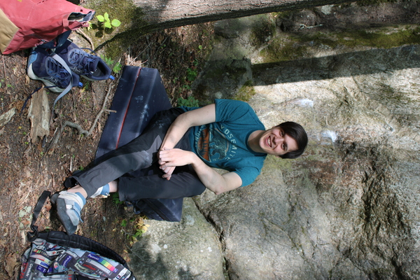

# About me

Hi, I am Emilio, and I am a postdoc at KTH, Stockholm. Thanks for visiting my website!

Before doing that, I got my Ph.D. at TU Delft, my Master's at ETH Zurich, and my Bachelor at the University of Catania. I have spent some time doing research at UC Santa Barbara, CU Boulder and the Italian Istitute of Technology in Genova.

I work on automatic control for multi-agent systems, and particularly on game-theoretic model predictive control. This controller creates smart agents that are able to predict and adapt to the maneuvers of other intelligent systems, leading to more intelligent, coordinated decision-making.   

I am interested in fundamental questions regarding stability and performance guarantees of these controllers, as well as experimental validation in multi-agent robotics, autonomous driving, and power distribution systems.

I have a background in robotics and electrical engineering, and I'm not afraid to use it.

In my spare time, I play the guitar, I maintain my music collection, and several other hobbies. My favorite band is [My bloody valentine](https://www.youtube.com/watch?v=hSI_9P9rRt4&list=RDhSI_9P9rRt4).

Get in touch if you're interested in what I do!

{ width=400 }
